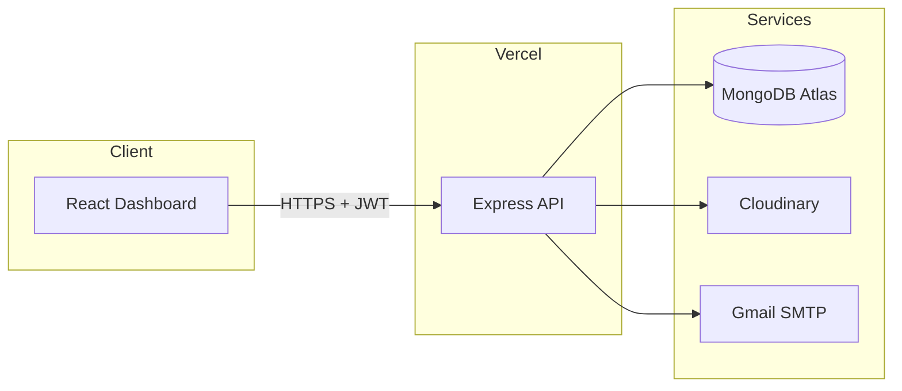

# MERN Job Posting App

[](https://mern-job-posting-app.vercel.app/api/ping)
[](https://nodejs.org/)
[](https://react.dev/)
[](https://www.mongodb.com/atlas)
[](LICENSE)

Full-stack job board with role-based access, a modern React dashboard, Cloudinary image uploads, and automated email alerts when new positions are published.

**Repository:** [github.com/Tadeosoto/MERN-job-posting-app](https://github.com/Tadeosoto/MERN-job-posting-app)  
**Live API:** [mern-job-posting-app.vercel.app](https://mern-job-posting-app.vercel.app/api/ping)

---

## Overview

This project simulates a small **hiring platform**: employers and admins publish job openings; employees browse listings and receive email notifications for new opportunities. It demonstrates end-to-end MERN development—from database modeling and secured REST APIs to a responsive UI with session management.

Built as a learning and portfolio project, it reflects patterns used in production apps: authentication, authorization, file uploads to cloud storage, transactional email, input sanitization, rate limiting, and serverless deployment.

### Why it matters (for recruiters)

| Area | What I implemented |
|------|-------------------|
| **Backend** | REST API with Express 5, Mongoose, JWT auth, protected routes |
| **Security** | Helmet, rate limiting, NoSQL injection sanitization, bcrypt passwords, role-based access |
| **Integrations** | MongoDB Atlas, Cloudinary (profile images), Gmail/Nodemailer (job alerts) |
| **Frontend** | React 19 + Vite dashboard: login, CRUD jobs, search, pagination, admin panel |
| **DevOps** | Vercel serverless deployment, environment-based config, `.env` secrets excluded from Git |

---

## Features

- **User registration & login** — JWT sessions; profile photo upload to Cloudinary
- **Roles** — `admin`, `employer`, `employee` with different permissions
- **Job management** — Create, read, update, delete job postings (title, company, location, salary)
- **Email notifications** — Employees (and configured recipients) get HTML emails when a job is posted
- **Dashboard UI** — Dark-themed admin-style interface; no Postman required for daily use
- **Search & pagination** — Filter jobs by title; paginated API responses
- **Admin panel** — List all registered users (admin only)

---

## Tech stack

| Layer | Technologies |
|-------|----------------|
| **Frontend** | React 19, React Router, Vite, CSS (custom design system) |
| **Backend** | Node.js, Express 5, Mongoose |
| **Database** | MongoDB Atlas |
| **Auth** | JSON Web Tokens (JWT), bcrypt |
| **Storage** | Cloudinary (images) |
| **Email** | Nodemailer + Gmail App Password |
| **Security** | Helmet, express-rate-limit, express-mongo-sanitize, CORS |
| **Deploy** | Vercel (serverless functions) |

---

## Architecture



```
mern-stack-project/
├── client/                 # React + Vite frontend
│   └── src/
│       ├── pages/          # Login, Dashboard, Admin
│       ├── components/     # Layout, JobCard, forms
│       └── context/        # Auth session
├── controllers/            # Business logic
├── models/                 # Mongoose schemas (User, Job)
├── routes/                 # API routes
├── middleware/             # Auth, upload, email
├── config/                 # Cloudinary
└── index.js                # Express app entry
```

---

## Getting started

### Prerequisites

- Node.js 18+
- MongoDB Atlas cluster ([Network Access](https://www.mongodb.com/docs/atlas/security-whitelist/) configured for your environment)
- Cloudinary account
- Gmail with [App Password](https://support.google.com/accounts/answer/185833) (for Nodemailer)

### 1. Clone & configure API

```bash
git clone https://github.com/Tadeosoto/MERN-job-posting-app.git
cd MERN-job-posting-app
npm install
copy .env.example .env   # Windows — use `cp` on macOS/Linux
```

Fill in `.env` (see `.env.example`). **Never commit `.env`.**

### 2. Run API

```bash
npm run dev
```

API base: `http://localhost:3000/api`

### 3. Run frontend (optional)

```bash
cd client
npm install
copy .env.example .env
npm run dev
```

Open `http://localhost:5173` — Vite proxies `/api` to the backend locally.

### 4. Seed admin user (optional)

```bash
node seedAdmin.js
```

Default: `admin@example.com` / `admin123` — change after first login in production.

---

## Environment variables

| Variable | Description |
|----------|-------------|
| `MONGODB_URI` | MongoDB connection string |
| `SECRET_KEY` | JWT signing secret |
| `CLOUD_NAME` | Cloudinary cloud name |
| `API_KEY` | Cloudinary API key |
| `API_SECRET_KEY` | Cloudinary API secret |
| `EMAIL` | Sender Gmail address |
| `PASSWORD` | Gmail app password |

Frontend (`client/.env`):

| Variable | Description |
|----------|-------------|
| `VITE_API_URL` | API base URL (e.g. `http://localhost:3000/api` or production URL) |

---

## API overview

| Method | Endpoint | Auth | Description |
|--------|----------|------|-------------|
| `GET` | `/api/ping` | — | Health check |
| `POST` | `/api/users` | — | Register (multipart: optional `pic`) |
| `POST` | `/api/users/signin` | — | Login → `{ token, user }` |
| `GET` | `/api/users/me` | Bearer | Current user |
| `GET` | `/api/users` | Admin | List users |
| `GET` | `/api/jobs` | Bearer | List jobs (search, pagination) |
| `POST` | `/api/jobs` | Bearer | Create job + send emails |
| `PUT` | `/api/jobs/:id` | Bearer | Update job |
| `DELETE` | `/api/jobs/:id` | Bearer | Delete job |

Protected routes require header: `Authorization: Bearer <token>`

---

## Deployment

| Component | Platform | Notes |
|-----------|----------|--------|
| **API** | Vercel (repo root) | Set all env vars in project settings |
| **UI** | Vercel (`client/` root) | `VITE_API_URL=https://<your-api>.vercel.app/api` |

MongoDB Atlas: allow `0.0.0.0/0` for serverless IPs or use Atlas-specific Vercel integration.

---

## Roadmap / possible improvements

- [ ] Deploy frontend to production URL and add screenshots to README
- [ ] Unit / integration tests (Jest, Supertest)
- [ ] Refresh tokens & httpOnly cookies
- [ ] Job `description` field in schema + rich text in UI
- [ ] CI/CD with GitHub Actions

---

## Author

**Tadeo Soto** — [GitHub @Tadeosoto](https://github.com/Tadeosoto)

If you're reviewing this for hiring purposes, I'm happy to walk through architecture decisions, security trade-offs, or live demo the app in a call.

---

## Resumen en español

Aplicación full-stack tipo **bolsa de empleo**: registro con foto (Cloudinary), login con JWT, roles (`admin`, `employer`, `employee`), CRUD de vacantes, correos automáticos a empleados y dashboard React para usar todo desde el navegador. API desplegada en Vercel; MongoDB Atlas como base de datos.

---

## License

ISC
