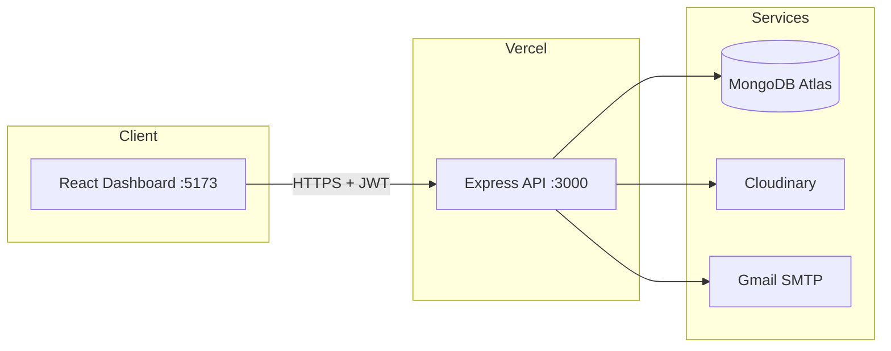

# MERN Job Posting App

[](https://mern-job-posting-app.vercel.app/api/ping)
[](https://nodejs.org/)
[](https://react.dev/)
[](https://www.mongodb.com/atlas)
[](LICENSE)

Full-stack job board with **role-based access**, a **React dashboard**, **job ownership** for employers, **Cloudinary** profile photos, and **email alerts** when new positions are published.

**Repository:** [github.com/Tadeosoto/MERN-job-posting-app](https://github.com/Tadeosoto/MERN-job-posting-app)  
**Live API:** [mern-job-posting-app.vercel.app](https://mern-job-posting-app.vercel.app/api/ping)

---

## Overview

This project is a small **hiring platform**: employers publish job openings they own; employees browse listings and get notified by email; admins manage users and have full control over jobs.

It covers the full MERN stack—MongoDB, Express 5, React 19, Node.js—with JWT sessions, protected routes, a modern dark UI, and deployment on Vercel.

### Why it matters (for recruiters)

| Area | What I implemented |
|------|-------------------|
| **Backend** | REST API, Mongoose models, JWT auth, role + ownership checks on mutations |
| **Security** | Helmet, rate limiting, NoSQL sanitization, bcrypt, Express 5 compatibility fixes |
| **Integrations** | MongoDB Atlas, Cloudinary, Gmail/Nodemailer |
| **Frontend** | React dashboard: login/register, job CRUD UI, search, pagination, admin user management |
| **Authorization** | Three roles with distinct permissions; employers only edit their own postings |
| **DevOps** | Vercel serverless API, separate frontend deploy, env-based secrets |

---

## Features

### Authentication & users

- Register with optional profile photo (Cloudinary)
- Login with JWT; session persisted in the browser
- Roles: `admin`, `employer`, `employee` (set on register: `employer` or `employee`; admin via seed script)
- `GET /api/users/me` to restore session

### Jobs

- List all jobs with **search** (title, company, location) and **pagination**
- Each job stores **`postedBy`** (creator user id)
- **Email notifications** to all `employee` users (and configured sender) when a job is posted
- Jobs show publisher info in API responses (`populate` on `postedBy`)

### Dashboard UI (`client/`)

- Dark-themed responsive layout with sidebar navigation
- Login / register pages
- Job board with search, pagination, edit modal
- **“Tu publicación”** badge on jobs you created (employer)
- Post job form (employers & admins only)
- Admin panel: list users, **delete users** (cannot delete yourself)

### Security & ops

- Protected API routes (`Authorization: Bearer <token>`)
- Rate limiting, CORS, Helmet
- `.env` excluded from Git; `.env.example` provided
- MongoDB connection caching for Vercel serverless

---

## Role permissions

| Action | Admin | Employer | Employee |
|--------|:-----:|:--------:|:--------:|
| View all jobs | ✅ | ✅ | ✅ |
| Search / paginate jobs | ✅ | ✅ | ✅ |
| Post new job | ✅ | ✅ | ❌ |
| Edit job | Any job | **Own jobs only** | ❌ |
| Delete job | Any job | **Own jobs only** | ❌ |
| Register / login | ✅ | ✅ | ✅ |
| List all users | ✅ | ❌ | ❌ |
| Delete users | ✅ (not self) | ❌ | ❌ |
| Receive job alert emails | — | — | ✅ |

---

## Tech stack

| Layer | Technologies |
|-------|----------------|
| **Frontend** | React 19, React Router 7, Vite 8, custom CSS |
| **Backend** | Node.js, Express 5, Mongoose 9 |
| **Database** | MongoDB Atlas |
| **Auth** | JWT, bcryptjs |
| **Storage** | Cloudinary (multer memory → base64 upload) |
| **Email** | Nodemailer + Gmail App Password |
| **Security** | Helmet, express-rate-limit, express-mongo-sanitize, CORS |
| **Deploy** | Vercel (API + optional frontend) |

---

## Architecture



```
mern-stack-project/
├── client/                 # React + Vite frontend
│   └── src/
│       ├── pages/          # Login, Register, Dashboard, PostJob, AdminUsers
│       ├── components/     # Layout, JobCard, JobForm, ProtectedRoute
│       ├── context/        # AuthContext (session, canManageJob)
│       └── api/            # API client
├── controllers/            # userController, jobController
├── models/                 # Users, Jobs (postedBy)
├── routes/
├── middleware/             # auth, upload, nodemailer
├── config/                 # cloudinary
├── seedAdmin.js
├── vercel.json
└── index.js
```

---

## Getting started

### Prerequisites

- Node.js 18+
- MongoDB Atlas ([Network Access](https://www.mongodb.com/docs/atlas/security-whitelist/) — use `0.0.0.0/0` for Vercel)
- Cloudinary account
- Gmail [App Password](https://support.google.com/accounts/answer/185833)

### 1. Clone & install API

```bash
git clone https://github.com/Tadeosoto/MERN-job-posting-app.git
cd MERN-job-posting-app
npm install
copy .env.example .env   # Windows — use `cp` on macOS/Linux
```

Fill in `.env`. **Never commit `.env`.**

### 2. Run API

```bash
npm run dev
```

API: `http://localhost:3000/api`  
Health: `http://localhost:3000/api/ping`

### 3. Run frontend

```bash
cd client
npm install
copy .env.example .env
npm run dev
```

Open **`http://localhost:5173`** — Vite proxies `/api` → `localhost:3000` by default.

For local API only (no proxy file), set in `client/.env`:

```env
VITE_API_URL=http://localhost:3000/api
```

### 4. Create admin user

```bash
npm run seed:admin
```

| Field | Value |
|-------|--------|
| Email | `admin@example.com` |
| Password | `admin123` |

Re-running the seed **resets** the admin password if the user already exists.

### 5. Quick test flow

1. **Admin** — login → Users → manage accounts; edit any job  
2. **Register** as **Employer** → Publicar empleo → edit/delete only your posts  
3. **Register** as **Employee** → browse jobs; receive email when employers post  

---

## Environment variables

### API (root `.env`)

| Variable | Description |
|----------|-------------|
| `MONGODB_URI` | MongoDB connection string |
| `SECRET_KEY` | JWT signing secret |
| `CLOUD_NAME` | Cloudinary cloud name |
| `API_KEY` | Cloudinary API key |
| `API_SECRET_KEY` | Cloudinary API secret |
| `EMAIL` | Sender Gmail address |
| `PASSWORD` | Gmail app password |

### Frontend (`client/.env`)

| Variable | Description |
|----------|-------------|
| `VITE_API_URL` | API base URL (omit locally to use Vite proxy, or set production URL) |

---

## API reference

All protected routes: `Authorization: Bearer <token>`

| Method | Endpoint | Auth | Description |
|--------|----------|------|-------------|
| `GET` | `/api/ping` | — | Health check |
| `POST` | `/api/users` | — | Register (`multipart/form-data`: `name`, `email`, `password`, optional `role`, optional `pic`) |
| `POST` | `/api/users/signin` | — | Login → `{ token, user }` |
| `GET` | `/api/users/me` | Bearer | Current user |
| `GET` | `/api/users` | Admin | List users |
| `DELETE` | `/api/users/:id` | Admin | Delete user (not self) |
| `GET` | `/api/jobs` | Bearer | List jobs (`?search=&page=&limit=&sort=-createdAt`) |
| `GET` | `/api/jobs/:id` | Bearer | Single job |
| `POST` | `/api/jobs` | Employer/Admin | Create job (`postedBy` = current user) + emails |
| `PUT` | `/api/jobs/:id` | Owner/Admin | Update job |
| `DELETE` | `/api/jobs/:id` | Owner/Admin | Delete job |

**Register roles:** only `employer` or `employee` allowed via API; default `employer`.

**Job mutations:** employers receive `403` if they try to edit/delete another user's job.

---

## Deployment

### API (repo root)

1. Connect repo on [Vercel](https://vercel.com)
2. Add all root `.env` variables
3. Deploy — `vercel.json` routes requests to `index.js`

### Frontend (`client/`)

1. New Vercel project, same repo
2. **Root Directory:** `client`
3. Environment variable:
   ```env
   VITE_API_URL=https://mern-job-posting-app.vercel.app/api
   ```
4. Deploy → use this URL as your public app (not the API root, which returns JSON)

### MongoDB Atlas

- **Network Access:** allow `0.0.0.0/0` for serverless (or restrict per your setup)
- **Database Access:** user in `MONGODB_URI` with read/write

---

## Scripts

| Command | Where | Description |
|---------|-------|-------------|
| `npm run dev` | root | API with nodemon |
| `npm start` | root | API production mode |
| `npm run seed:admin` | root | Create/reset admin user |
| `npm run dev` | `client/` | Vite dev server |
| `npm run build` | `client/` | Production build |

---

## Roadmap

- [ ] Production frontend URL + screenshots in README
- [ ] Job `description` field + rich UI
- [ ] Unit / integration tests (Jest, Supertest)
- [ ] Refresh tokens / httpOnly cookies
- [ ] CI/CD (GitHub Actions)

---

## Author

**Tadeo Soto** — [GitHub @Tadeosoto](https://github.com/Tadeosoto)

Open to discussing architecture, security choices, or a live walkthrough for hiring teams.

---

## Resumen en español

**Bolsa de empleo full-stack (MERN)** con:

- **Dashboard React** (login, registro, listado de vacantes, publicar/editar con botones)
- **Roles:** `admin` (todo + borrar usuarios), `employer` (publica y solo edita **sus** empleos), `employee` (solo ve y recibe correos)
- **JWT** para sesiones, fotos en **Cloudinary**, alertas por **Gmail**
- Cada empleo guarda **`postedBy`** para control de propiedad
- API en **Vercel**, base de datos en **MongoDB Atlas**

**Local:** `npm run dev` en la raíz + `npm run dev` en `client/` → [http://localhost:5173](http://localhost:5173)

**Admin:** `npm run seed:admin` → `admin@example.com` / `admin123`

---

## License

ISC
